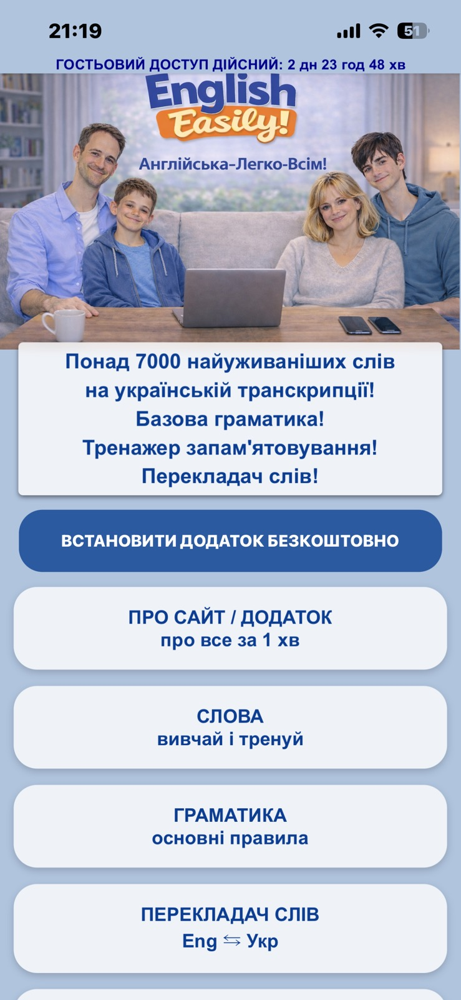
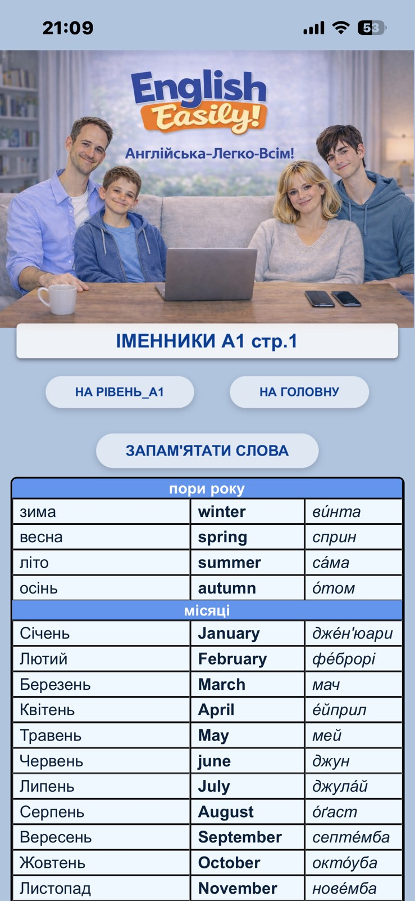
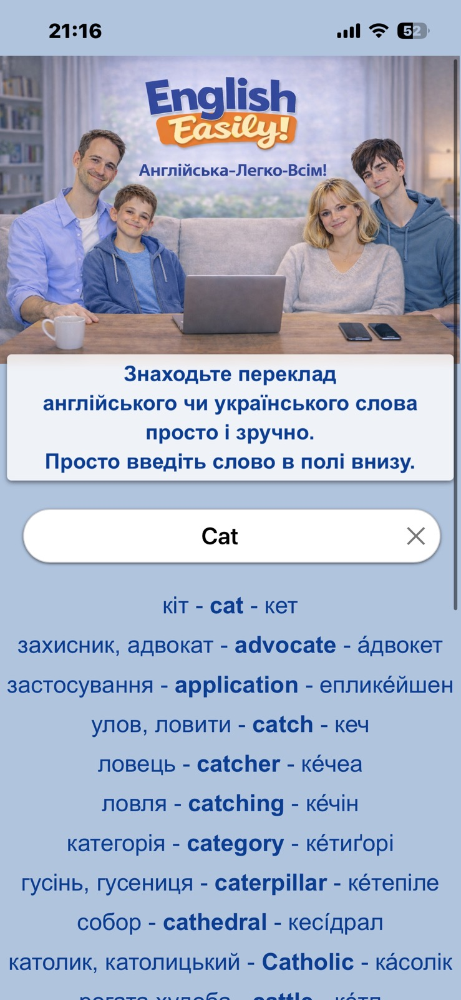
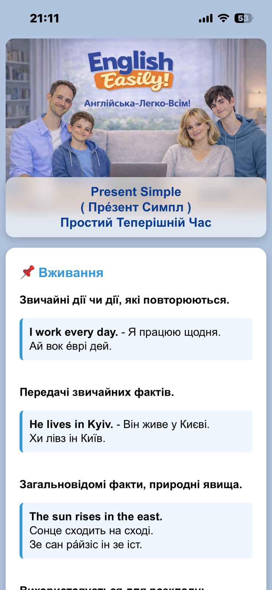
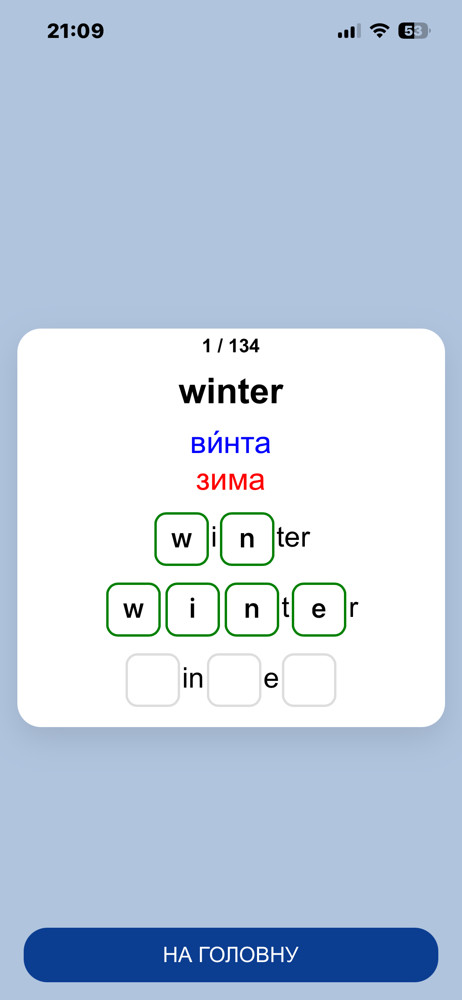
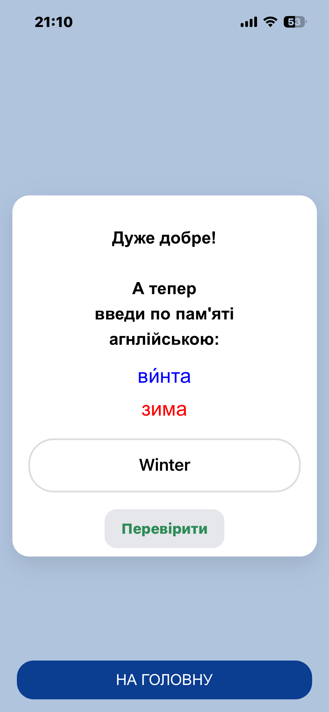

# English Easily Demo
An English learning platform with:
- Ukrainian word transcription,
- a two-way word translator,
- basic grammar,
- PWA support.

## Features
- Progressive Web App (PWA)
- User registration and login
- English learning materials by levels A1-A2-B1-B2
- About 7000 words
- Built-in Eng-Ua/Ua-Eng word translator
- Search system for words and transcripts
- Base grammar
- Mobile-friendly interface
- Progress tracking

## Technologies
- Python
- Django
- HTML
- CSS
- JavaScript
- SQLite
- PWA

## Live Website
https://english-easily.com

## Author
Bohdan Olianitsky

## Screenshots

### Home Page

### Word Translator

### Search System

### Grammar Section

### Training Mode

### Training Mode 2

